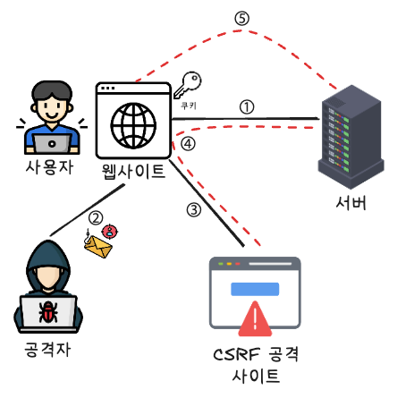

# 사이트 간 요청 위조 (CSRF, Cross-site Request Forgery)

사용자가 자신의 의지와 무관하게 공격자가 의도한 행위(수정, 삭제, 등록 등)를 특정 웹사이트에 요청하게 만드는 대표적인 웹 보안 공격이다.

특정 웹사이트가 사용자의 웹 브라우저를 신용(자동으로 쿠키를 실어 보내는 특성)하는 점을 노린 것으로,  
사용자가 웹사이트에 로그인한 상태에서 CSRF 공격 코드가 삽입된 악성 페이지를 열면, 공격 대상이 되는 웹사이트는 이를 '믿을 수 있는 정상적인 사용자로부터 온 요청'으로 판단하여 공격에 노출된다.

---

## 1. CSRF 공격 루트

**"이미 웹사이트에 사용자가 로그인하여 브라우저 쿠키에 세션 ID가 저장되어 있다"** 는 강력한 전제 조건 하에 공격이 진행된다.

이메일의 링크로 연결되는 페이지나 커뮤니티 게시글 내에 이미지 태그, `form` 태그 내 숨겨진 `input` 양식, 자바스크립트 `fetch` 등 다양한 경로를 통해 공격용 악성 코드가 심어진다.

### ① 이미지 태그 (`GET` 요청 유도)

브라우저가 이미지 파일을 불러오기 위해 자동으로 주소를 호출하는 특성을 악용하는 방식이다.

```html

```

### ② 숨겨진 `input` 양식 (`POST` 요청 유도)

자바스크립트를 이용해 페이지가 열리자마자 자동으로 `submit()` 되도록 유도합니다

```html
<form action="https://ddongman.com/member/change" method="POST">
  <input type="hidden" id="nickname" name="nickname" value="해킹당했쥬" />
</form>
```

### 자바스크립트 `fetch` (비동기 요청 유도)

```javascript
fetch("https://ddongman.com/member/change", {
  method: "POST",
  headers: {
    "Content-Type": "application/json",
  },
  body: JSON.stringify({ nickname: "해킹당했쥬" }),
});
```

## 2. CSRF 공격 프로세스

1. **이용자는 정상 사이트(ddongman.com)에 로그인하여 세션 쿠키를 발급받는다.**

2. **공격자는 CSRF 공격 코드가 심어진 악성 페이지(http://hack.com/attacker)를 만들고, 이메일이나 게시판을 통해 이용자가 이를 열도록 유도한다.**

3. **사용자가 공격자의 HTML 페이지에 접속한다.**  
   해당 페이지에는 타깃 서버를 공격하는 이미지 태그 등이 숨겨져 있다.
   ```javascript
       
   ```
   이용자가 이 페이지를 여는 순간, 브라우저는 이미지를 로딩하기 위해 공격 URL로 요청을 보낸다.
4. **이용자의 인지 없이, 브라우저가 보관하던 ddongman.com용 세션 쿠키가 요청에 자동으로 동봉되어 전송된다.**
5. **서버는 쿠키를 확인하고 정상적인 사용자의 요청으로 착각하여, 공격자가 의도한 대로 비밀번호 변경이나 회원정보 수정을 처리한다**



## 3. CSRF 방어 기법

### 1) `Referer` 요청 헤더 검증

HTTP 헤더 중 하나인 Referer(요청을 보낸 이전 페이지 주소)와 타깃 서버의 Host(도메인)를 비교하여, 출처가 다른 곳에서 온 요청(예: hack.com에서 출발한 요청)을 거부하는 방식이다.
다만, Referer 헤더는 프록시 툴로 조작되거나 사생활 보호 정책에 의해 브라우저 단에서 숨겨질 수 있으므로 부차적인 검증 용도로 사용하는 것이 안전하다.

### 2) CSRF 토큰 방식

가장 대중적이고 확실한 방어 기법으로 구조에 따라 크게 세션 방식과 세션리스 방식으로 나뉜다.

#### ① 동기화 토큰 패턴 (STP, Synchronizer Token Pattern)

진짜 토큰을 서버의 세션 메모리에 저장해 두고 검증하는 방식으로, 주로 서버 사이드 렌더링(SSR) 환경에서 사용한다.

- **1단계 (서버)**: 사용자가 로그인하면 서버는 암호학적으로 안전한 CSRF 토큰을 생성하여 서버 세션에 저장한다.

- **2단계 (화면 렌더링)**: HTML의 폼(<form>)을 생성할 때, 숨겨진 입력 태그를 통해 토큰 값을 함께 심어서 클라이언트에 보낸다.

```html
<input type="hidden" name="_csrf" value="csrf_token_값" />
```

- **3단계 (검증)**: 사용자가 폼을 제출하면, 서버는 요청 바디(Body)에 담겨온 토큰값과 자기 세션 메모리에 보관 중인 토큰값을 대조하여 검증한다.

#### ② Cookie-to-header token 패턴

서버 세션 메모리를 쓰지 않는 가벼운(Stateless) 방식이며, 주로 React/Vue 같은 모던 SPA 환경에서 사용된다. 반드시 탈취의 위험성으로 HTTPS 환경이 강제된다.

**1단계 (서버)**: 서버가 로그인 시 랜덤한 CSRF 토큰을 생성해 브라우저 쿠키에 저장하게 만듦.

```http
Set-Cookie: __Host-csrf_token=i8XNjC4b8KVok4uw5RftR38Wgp2BFwql; Expires=Thu, 23-Jul-2015 10:25:33 GMT; Max-Age=31449600; Path=/; SameSite=Lax; Secure
```

**2단계 (클라이언트)**: 자바스크립트(Axios, Fetch 등)가 쿠키에서 이 토큰 값을 읽어와, 매 요청마다 HTTP 커스텀 헤더(X-Csrf-Token)에 똑같이 복사해서 전송한다.

```http
X-Csrf-Token: i8XNjC4b8KVok4uw5RftR38Wgp2BFwql
```

**3단계 (검증)**: 서버는 요청에 포함된 [쿠키 속 토큰]과 [헤더 속 토큰]을 꺼내 그 자리에서 서로 일치하는지 비교합니다.

**주의점**: 자바스크립트가 쿠키를 읽어야 하므로 쿠키의 HttpOnly 설정을 켜면 안 됩니다. 이로 인해 사이트에 XSS(크로스 사이트 스크립팅) 취약점이 터질 경우 CSRF 토큰까지 함께 탈취당할 수 있는 약점이 있습니다.

#### ③ 이중 제출 쿠키 패턴 (Double-Submit Cookie Pattern)

Cookie-to-Header 방식과 철학은 동일하지만, 자바스크립트가 관여하지 않는 전통적인 폼 전송 방식입니다

- 토큰 값을 헤더가 아니라 HTML <form>의 hidden 필드에 원본 그대로 심어 보낸다.

- 서버는 요청이 올 때 [자동으로 날아온 쿠키 속 토큰]과 [폼 데이터 바디 속 토큰]이 일치하는지 대조하다.

- 공격자 사이트는 동일 출처 정책(SOP) 때문에 우리 사이트의 쿠키를 마음대로 읽거나 조작할 수 없으므로 안전하다.

- **주의점 (우회 리스크)**: 서버가 토큰을 기억하지 않는 아주 가벼운 구조이지만, 만약 웹사이트 내부에 쿠키를 마음대로 임의 설정할 수 있는 기능(Cookie Setting Functionality)이나 서브도메인 취약점이 존재한다면, 해커가 가짜 쿠키를 주입하여 이 검증 로직을 쉽게 우회할 수 있다.

### 3) SameSite 쿠키 속성 이용

쿠키 자체에 '출처에 따른 전송 제한 규칙'을 부여하여 위의 토큰 방식들을 강력하게 보완하거나 대체한다.

속성 값은 다음의 세 가지로 나뉜다.

- **Strict**: 반드시 동일한 도메인(Same-Origin)에서 출발한 요청에만 쿠키를 실어 보낸다. 타 도메인에서의 링크 클릭 이동 시에도 쿠키가 전송되지 않아 다소 불편할 수 있다.

- **Lax**: 다른 도메인에서 출발한 악성 요청(POST/PUT 등)에는 쿠키를 완전히 제외하지만, 사용자가 직접 링크를 클릭하여 이동하는 안전한 상황(일반적인 GET 요청)에는 쿠키 전송을 허용한다. (현대 브라우저들의 기본값)

- **None**: 크로스 사이트 요청에도 무조건 쿠키를 전송한다. 반드시 Secure 옵션과 함께 사용되어야 한다.

현대 브라우저들은 SameSite=Lax 정책을 기본 탑재하고 있기 때문에, 특별한 설정을 하지 않아도 제3의 사이트에서 유도하는 유해한 CSRF 공격의 대부분을 브라우저 차원에서 원천 차단할 수 있다.

## 출처

[CSRF 공격에 대해서 설명해주세요. - 매일메일](https://www.maeil-mail.kr/question/168)
[Cross-site request forgery - wikipedia](https://en.wikipedia.org/wiki/Cross-site_request_forgery#cite_note-31)
[CSRF(Cross-Site Request Forgery) 공격과 방어 - 강준현 소프투웨어 엔지니어 블로그](https://junhyunny.github.io/information/security/spring-boot/spring-security/cross-site-reqeust-forgery/)  
[쿠키의 SameSite 옵션이란? - codeit](https://www.codeit.kr/tutorials/94/%EC%BF%A0%ED%82%A4%EC%9D%98%20SameSite%20%EC%98%B5%EC%85%98%EC%9D%B4%EB%9E%80%3F)
