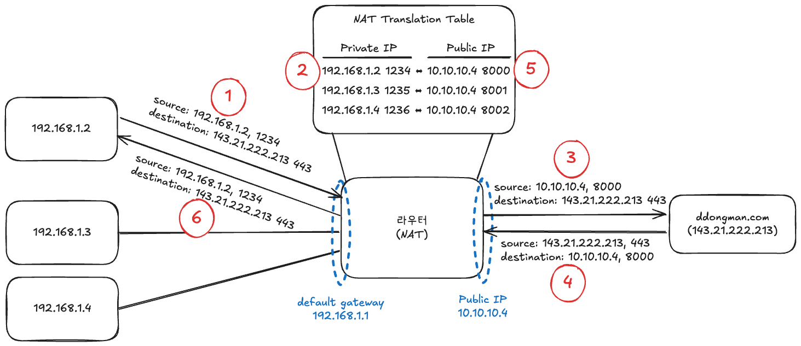

# NAT(Network Address Translation, 네트워크 주소 변환)

트래픽 라우터(Traffic Router)를 통과하는 동안 패킷의 IP 헤더에 있는 네트워크 주소 정보를 수정하여 IP 주소 영역을 다른 IP 주소 영역으로 매핑(변환)하는 기법을 말한다.

현재는 IPv4(Internet Protocol version 4) 주소 고갈 문제를 해결하고, 글로벌 주소 영역(global address space)을 절약하기 위한 방법으로 널리 쓰이고 있다. 주로 사설 네트워크에서 외부 인터넷과 통신할 때, 라우팅이 가능한 하나의 공인 IP 주소로 변환하여 나가는 용도로 사용된다.

---

## 1. 등장 배경

### ① 초기 용도 (네트워크 재지정 우회)

초기에는 회사의 네트워크를 이전하거나 인터넷 서비스 공급업체(ISP)가 변경되었을 때, 내부의 모든 호스트에 일일이 새로운 IP 주소를 재할당해야 하는 피하기 위해 사용되었다.

### ② 주소 고갈과 라우팅 확장 문제

1992년 즈음, 32비트 주소를 사용하는 IPv4는 **약 43억 개**의 장비만 고유하게 주소 지정할 수 있어, 기하급수적으로 늘어나는 인터넷 장비들을 감당하기 어렵다는 것이 명백해졌다.  
이에 따라 인터넷 프로토콜이 당면한 2가지 문제인 **IP 주소 고갈** 및 **라우팅 테이블 비대화 현상(Routing Scaling)**에 대한 단기적인 해결책으로 NAT 기술이 널리 확산되었다.

## 2. NAT의 주요 유형

### 기본 NAT (Basic NAT / One-to-One NAT)

- IP 주소를 1:1로 대응하여 변환하는 가장 단순한 유형이다.
- 주소 변환 과정에서 오직 IP 주소, IP 헤더 체크섬, 그리고 IP 주소를 계산에 포함하는 고수준(TCP/UDP)의 체크섬만이 변경된다.
- **주요 용도:** 서로 호환되지 않는 주소 체계를 가졌거나(IPv4와 IPv6 간 통신), 합병 등으로 인해 사설 IP 대역(예: `192.168.1.X`)이 겹쳐서 충돌이 발생하는 두 IP 네트워크를 상호 연결할 때 우회 통로로 사용된다.

### 일대다 NAT (NAPT / PAT / IP Masquerading)

여러 개의 사설 호스트들이 **하나의 공인 IP 주소**를 공유하여 외부 인터넷과 통신하는 방식이다.

- **모호함(Ambiguity) 방지를 위한 포트 변환**
  인터넷 트래픽의 대부분은 TCP 또는 UDP를 사용한다. 여러 컴퓨터가 하나의 공인 IP를 쓰면 나중에 서버에서 답장이 돌아올 때 누구에게 전달해야 할지 라우터가 헷갈리는 모호함이 발생한다. 이를 막기 위해 패킷의 IP 주소뿐만 아니라 **전송 계층의 '포트 번호'까지 중복되지 않게 임의로 수정하여 매핑**된다.

---

## 3. NAPT(일대다 NAT) 통신 프로세스

1. **사설 호스트의 요청:** 사설 IP를 가진 내부 컴퓨터가 특정 외부 서버(예: www.ddongman.com)로 데이터 패킷을 보낸다.
2. **NAT 테이블 매핑:** 라우터의 NAT 장비가 패킷을 가로채, 내부 사설 IP와 포트 번호를 자신의 공인 IP와 중복되지 않는 임의의 새로운 포트 번호로 변환하고 이 내역을 **NAT 변환 테이블(NAT Translation Table)**에 기록한다.
3. **외부 전송:** 변환이 완료된 공인 IP와 포트 주소를 달고 목적지인 외부 서버로 요청이 최종 전달된다.

### 📥 응답 단계 (Public $\rightarrow$ Private)

4. **서버의 회신:** 외부 서버가 요청을 처리한 후, 라우터의 공인 IP와 변환된 포트 번호를 목적지로 삼아 응답 패킷을 보낸다.
5. **역매핑(주소 역변환):** 패킷을 받은 라우터는 **NAT 변환 테이블**을 조회합니다. 들어온 포트 번호를 확인하여 이 요청을 처음에 보냈던 내부 사설 IP와 원래의 포트 번호로 패킷을 다시 되돌려 놓는다.
6. **최종 수신:** 요청을 보냈던 내부의 사설 IP 호스트가 아무런 모호함 없이 정확하게 응답 데이터를 수신한다.

## 출처

[NAT 기능을 사용하는 이유를 알고 계신가요? - 매일메일](https://www.maeil-mail.kr/question/164)
[Network address translation - wikipedia](https://en.wikipedia.org/wiki/Network_address_translation)
