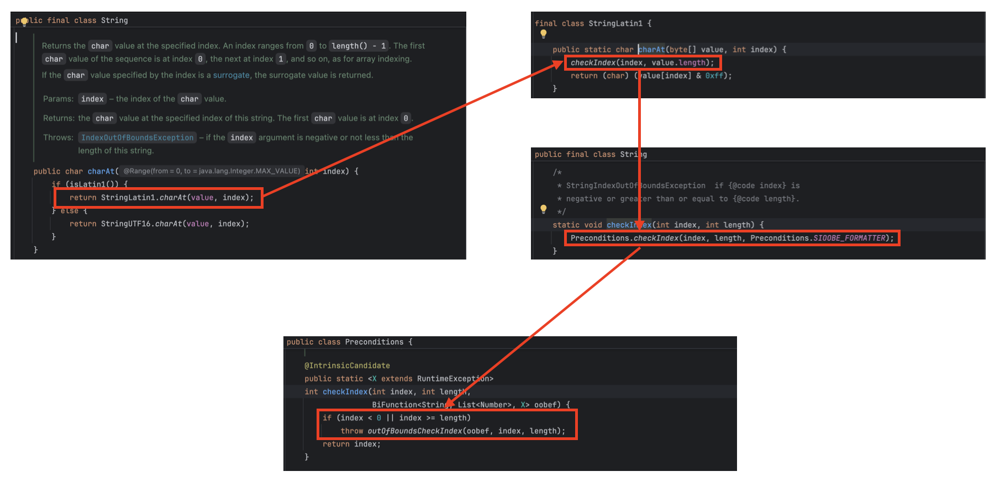

# 개요

자바에서 문자열의 각 요소에 접근하는 대표적인 방식으로 `charAt(int index)`과 `toCharArray()`가 있다.

예를 들어, 반복문을 통해 문자열의 모든 요소에 접근하는 코드는 다음과 같다.

```java
String str = "hello";

// 1. charAt()을 사용한 for문
for (int i = 0; i < str.length(); i++) {
    System.out.println(str.charAt(i));
}

// 2. toCharArray()를 사용한 for-each문
for (char c : str.toCharArray()) {
    System.out.println(c);
}
```

# 차이점

두 방식의 가장 큰 차이는 **"새로운 배열의 생성 여부(메모리 오버헤드)"** 와 **"내부 데이터 접근 방식"** 에 있다.

### 1. `toCharArray()` 방식

- **동작 원리:** 호출 시점의 문자열과 동일한 길이의 새로운 `char[]` 배열을 힙(Heap) 영역에 생성하고 데이터를 복사(System.arraycopy)한다. 그 후 복사된 배열의 인덱스에 직접 접근한다.
- **장단점:** 향상된 for-each 문을 사용할 수 있어 가독성이 좋고, 데이터를 직접 수정할 수 있는 가변(Mutable) 배열을 얻을 수 있다. 하지만 문자열 길이(N)만큼 **$O(N)$의 추가 공간 복잡도(메모리)** 가 발생한다.

  

### 2. `charAt(int index)` 방식

- **동작 원리:** 새로운 공간을 생성하지 않고, 기존 String 객체가 내부적으로 가지고 있는 바이트 배열(`byte[] value`)을 참조하여 지정된 인덱스의 값을 계산해 가져온다.
- **장단점:** 새로운 메모리를 할당하지 않으므로 공간 복잡도가 **$O(1)$** 로 매우 효율적이다. 다만, 반복문 안에서 매번 메서드를 호출해야 하는 약간의 오버헤드가 있으며 전통적인 for문만 사용할 수 있다.

  

# 요약 및 결론: 무엇을 선택해야 할까?

두 방식은 성능과 가독성 사이의 트레이드오프(Trade-off) 관계에 있으므로, 상황에 맞게 선택해야 한다.

### 성능 중심: `charAt()`

- **대용량 문자열을 처리할 때:** 수만 자 이상의 긴 문자열을 다룰 때 `toCharArray()`를 쓰면 무거운 배열 복사가 일어나고 GC(Garbage Collector)의 부담이 커집니다.

### 생산성 중심: `toCharArray()`

- **문자열 수정 및 배열 기능이 필요할 때:** 원본 문자열을 바탕으로 정렬(`Arrays.sort()`)을 하거나, 특정 위치의 문자를 서로 스왑(Swap)하는 등 '가변성(Mutable)'이 필요한 알고리즘 문제를 풀 때 유용합니다.

따라서 메모리와 성능이 극도로 중요한 대용량 데이터 처리에는 `charAt()`을, 짧은 문자열의 편리한 가독성과 가변 데이터 조작이 필요할 때는 `toCharArray()`를 선택하는 것이 좋다.

### 알고리즘에서 극단적인 성능 최적화가 필요할 때의 팁

대용량 텍스트 검색이나 알고리즘 문제 풀이 시, `word.charAt(i)`를 반복 호출하는 대신 시작할 때 `word.toCharArray()`로 배열을 뽑아두고 접근하는 방식을 사용한다.

그 이유는 **'배열 경계 검사(Bounds Check) 비용'** 때문이다.



위의 도식과 같이 `charAt()`은 호출될 때마다 인덱스가 유효한지 검사하는 조건문(`if (index < 0 || ...)`)을 내장하고 있다. 반면 자바에서 일반 배열(`char[]`)을 순회할 때는 JVM이 컴파일 시점에 경계 검사를 자체적으로 생략(Bounds Check Elimination)하는 최적화를 수행한다.

따라서 **동일한 문자열을 수없이 많이 재탐색해야 하는 복잡한 검색 알고리즘**에서는 최초 1회의 배열 생성 비용을 감수하더라도 `toCharArray()`를 사용해 배열 인덱스로 직접 접근하는 것이 문자열 내부의 경계 검사 비용을 감소시키는 대안이 될 수 있다.
